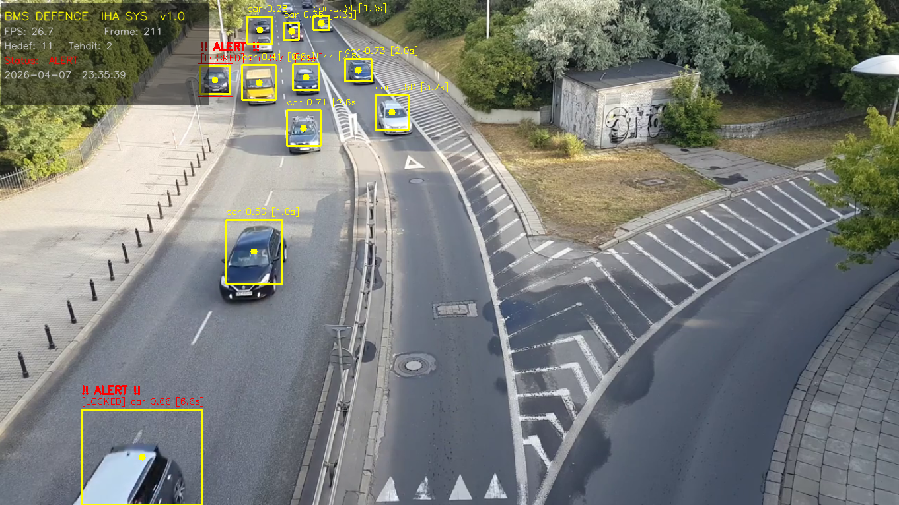

<div align="center">
  <h1>BMS DEFENCE - İHA Hedef Tespit ve Takip Sistemi</h1>
  <p>İnsansız Hava Araçları (İHA) için YOLOv8 ve Klasik Bilgisayarlı Görü Temelli Hibrit Hedef Takip Yazılımı</p>

  
</div>

<br>

İnsansız Hava Araçları kamerasına entegre edilmek üzere geliştirilmiştir. Standart derin öğrenme (YOLO) tespitlerini körü körüne kabul etmez; **Canny Kenar Analizi** ile çapraz doğrulamadan geçirerek gölge, asfalt lekesi gibi sahte tespitleri (False-Positive) %99'a varan oranda engeller.

---

## ✨ Öne Çıkan Özellikler

- **Hibrit Doğrulama Mimarisi:** YOLOv8 tespit kutusu içindeki piksel haritası incelenir, gerçek bir nesne formu taşımıyorsa tespit reddedilir.
- **Dwell-Time Tehdit Analizi:** Sistem, hareket eden veya park halinde sabit duran hedefleri analiz eder. Ekranda **4 saniyeden fazla (Dwell)** kalan hedefler otomatik olarak **[LOCKED]** durumuna geçerek "Tehdit" olarak işaretlenir.
- **Titreşimsiz (Jitter-Free) Takip:** Kamera sallantısı veya algoritmik oynamalara karşı hedeflerin X,Y eksenleri EMA (Üstel Hareketli Ortalama) yöntemiyle pürüzsüzleştirilmesi hedeflenmiştir.
- **Otomatik Loglama (Kara Kutu):** Kurulan her temas, saniyesi saniyesine `.csv` formatında raporlanır.

>  <br>
> *Hedef 4 saniye menzilde kaldığında sistemin kilitlenme (Lock-On) mekanizması devreye girer.*

---

## 🛠 Kurulum ve Kullanım


### 1. Dosyaları İndirin ve Klasöre Gidin
```bash
git clone https://github.com/KULLANICI_ADIN/bmsdefence_iha.git
cd bmsdefence_iha
```

### 2. Gerekli Kütüphaneleri Kurun
Python 3.8 - 3.11 arası bir sürüm kullandığınızdan emin olun (Önerilen: 3.10).
```bash
pip install -r requirements.txt
```

### 3. Sistemi Başlatın
```bash
python main.py
```

Başlattığınızda karşınıza konsol tabanlı **Görev Seçim Menüsü** gelecektir:
```text
  [1] Arac Simulasyonu (road.mp4)
  [2] Asker/Insan Simulasyonu (soldiers.mp4)
  [3] Canli Kamera (Webcam)
  [4] Ozel dosya yolu (Kendi klibini sec)
```
Rakamı tuşlayın ve Enter'a basın. Model dosyanız (YOLO ağırlıkları) sistem ilk defa başlatıldığında **otomatik olarak** inecektir.
Sistemden çıkmak istediğinizde Q tuşuna basın.
---

## 📁 Proje Klasör Yapısı

Projeye katkı sağlamak (Contribute) veya modülleri incelemek isteyenler için dosya ayrımı oldukça sadedir:

- `main.py` ➔ Pipeline yöneticisi, taktik ekran (HUD) çizimi ve menü paneli
- `tasks/` ➔ Okuma, İşleme, Tespit ve Aktarma adımlarının tekil sorumlulukla gerçekleştirildiği gövde
- `utils/` ➔ Centroid Tracking (Hafıza) metodu ve CSV log oluşturucu araçlar
- `config.py` ➔ Sistemin hassasiyet, renk ve boyut gibi tüm ayarlarının tek merkezden yapıldığı konfigürasyon modülü

